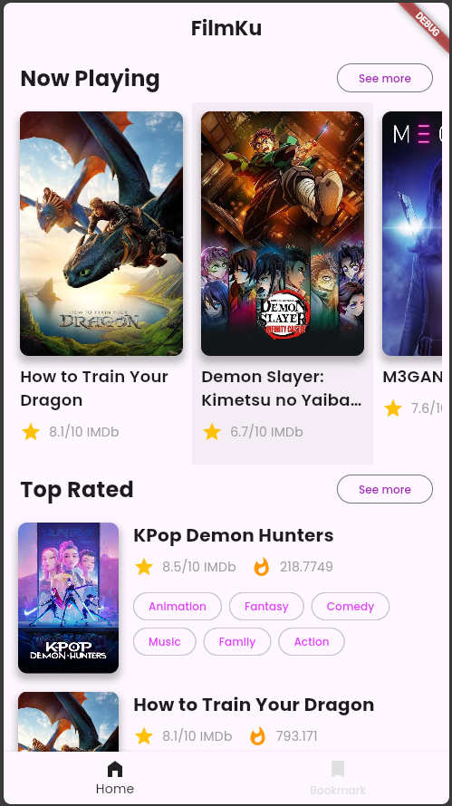
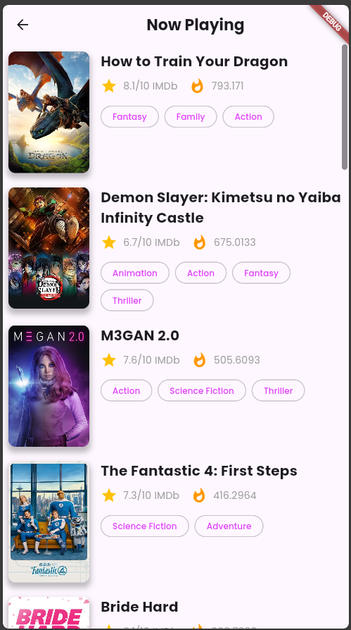
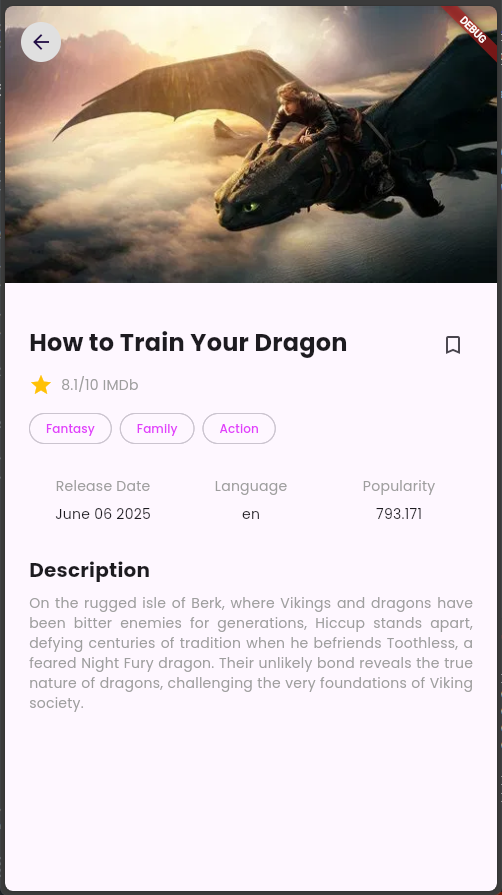
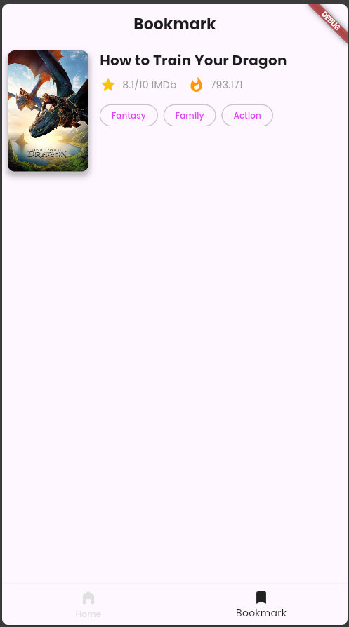

# 🎬 FilmKu App

Flutter submission project untuk kelas [Belajar Membuat Aplikasi Flutter untuk Pemula](https://www.dicoding.com/academies/159).

Aplikasi ini merupakan aplikasi Flutter bertema daftar informasi film. Data yang digunakan merupakan **data dummy** dari [The Movie Database (TMDB)](https://www.themoviedb.org/) dan fokus utama proyek ini adalah pada **tampilan antarmuka (UI)**.

---

## 🖌️ UI Design

Desain UI diadaptasi dari desain gratis milik komunitas Figma. Terima kasih kepada **Syahidina Alif** atas desainnya:

👉 [Movie Mobile App UI Design (Figma)](https://www.figma.com/community/file/1054431643740926668/movie-mobile-app-ui-design)

---

## 📱 App Features

### 🏠 Home
**Halaman Home** menampilkan 5 film dari dua kategori:
- **Now Playing**
- **Top Rated**



---

### 🎞️ Movie Category
**Halaman Detail Kategori Film** menampilkan daftar lengkap film berdasarkan kategori yang dipilih pengguna.



---

### 📋 Movie Detail
**Halaman Detail Film** menampilkan informasi lengkap dari film yang dipilih. Pengguna juga dapat menggunakan fitur **bookmark** pada halaman ini.



---

### 🔖 Bookmarked Movies
**Halaman Bookmark** menampilkan daftar film yang telah dibookmark oleh pengguna. Bookmark dikelola menggunakan **state & callback function** tanpa penyimpanan lokal.



---

## ⚙️ Cara Menjalankan Aplikasi

1. **Clone repository ini**
   ```bash
   git clone https://github.com/bayutp/dicoding-flutter-pemula.git
   cd dicoding-flutter-pemula
2. **Install dependency Flutter**
    ```bash
    flutter pub get
3. **Jalankan aplikasi di emulator atau perangkat fisik**
    ```bash
    flutter run

## 📌 Catatan Tambahan

- Proyek ini menggunakan data statis (dummy) dan belum mengintegrasikan API eksternal maupun local storage seperti SharedPreferences.

- Fitur bookmark hanya menggunakan stateful logic dan callback.

## 📄 Lisensi & Penggunaan Source Code

Source code ini bebas digunakan untuk belajar dan referensi pribadi.
Namun, dilarang mengirimkan ulang proyek ini secara langsung (tanpa modifikasi signifikan) sebagai submission di kelas [Belajar Membuat Aplikasi Flutter untuk Pemula](https://www.dicoding.com/academies/159) di Dicoding.

💡 Silakan gunakan sebagai inspirasi dan kembangkan sesuai gaya & ide kreatifmu sendiri.