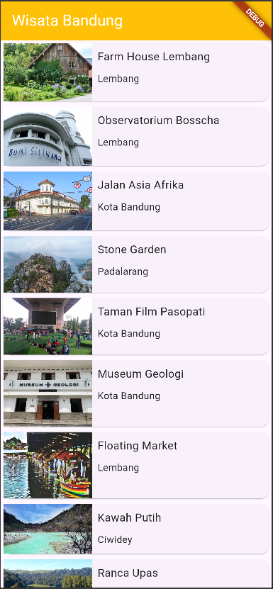
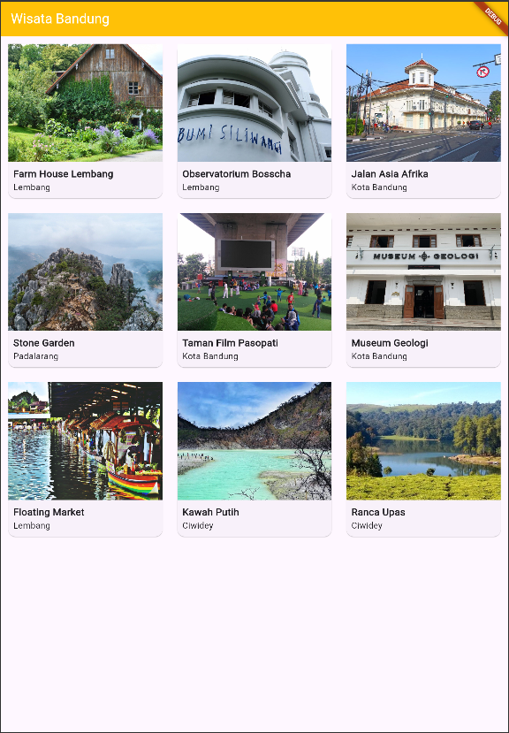
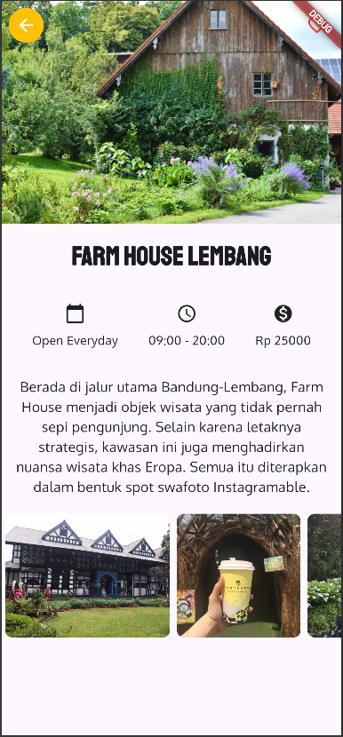
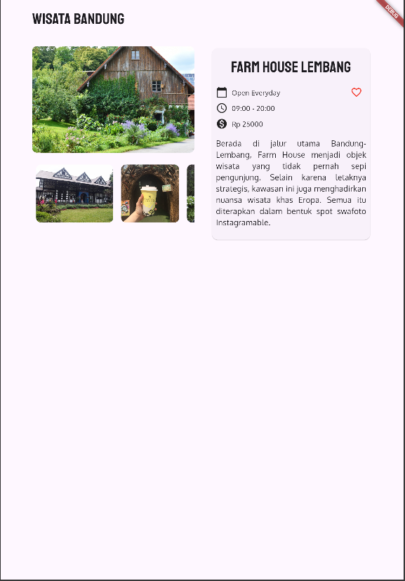

# Tourism App

Source: Dicoding Codelabs – Belajar Membuat Aplikasi Flutter untuk Pemula

## Home Screen

Displays a list of tourism places in Bandung.
### Mobile Version

### Web Version

## Detail Screen

Displays detailed information of the selected tourism place, including its image, description, location, and opening hours, when the user taps on an item from the home screen.
### Mobile Version

### Web Version

